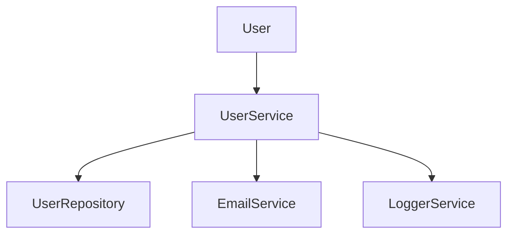
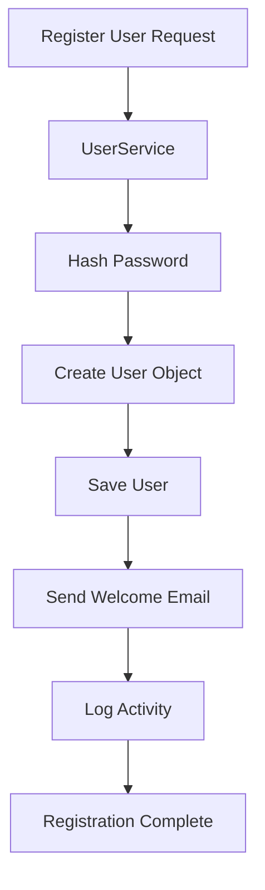

# Single Responsibility Principle (SRP) in Java

## Overview

This repository demonstrates the **Single Responsibility Principle (SRP)**, the first principle of the **SOLID Design Principles**.

> "A class should have only one reason to change."

SRP promotes maintainable, scalable, and testable software by ensuring that each class is responsible for a single concern.

This project models a simple **User Registration System** where responsibilities are properly separated into dedicated classes.

---

## Why Single Responsibility Principle?

Imagine a single class handling:

- User validation
- Password hashing
- Database operations
- Email notifications
- Logging

Such a class becomes difficult to:

- Maintain
- Test
- Scale
- Modify safely

SRP solves this problem by assigning one responsibility to each class.

---

## Project Structure

```plaintext
src/
│
├── User.java
├── UserRepository.java
├── EmailService.java
├── LoggerService.java
└── UserService.java
```

---

## Architecture Diagram



---

## Class Responsibilities

### 1. User

#### Responsibility

Represents user data only.

#### Handles

- Name
- Email
- Password

#### Does NOT Handle

- Database operations
- Logging
- Email sending
- Business logic

```java
User user = new User(name, email, password);
```

**Reason to Change:**  
Only if the user data model changes.

---

### 2. UserRepository

#### Responsibility

Handles persistence operations.

#### Handles

- Save user
- Read user
- Update user
- Delete user

```java
userRepository.save(user);
```

**Reason to Change:**  
Only if database implementation changes.

Examples:

- MySQL → PostgreSQL
- SQL → MongoDB
- Local Database → Cloud Database

---

### 3. EmailService

#### Responsibility

Handles email-related functionality.

```java
emailService.sendEmail(email);
```

**Reason to Change:**  
Only if email requirements change.

Examples:

- SMTP integration
- SendGrid integration
- Amazon SES integration
- Email template changes

---

### 4. LoggerService

#### Responsibility

Handles logging.

```java
logger.log("User registered");
```

**Reason to Change:**  
Only if logging strategy changes.

Examples:

- Console Logging
- ELK Stack
- Splunk
- Datadog

---

### 5. UserService

#### Responsibility

Coordinates the complete registration workflow.

#### Responsibilities

- Password hashing
- User creation
- Repository interaction
- Email notification
- Logging

```java
registerUser(...)
```

This class acts as an **orchestration layer**.

**Reason to Change:**  
Only if user registration business rules change.

---

## Registration Flow



---

## Execution Example

### Input

```java
registerUser(
    "Kunj",
    "kunj@gmail.com",
    "password123"
);
```

### Output

```text
Saving the user to database: Kunj

Sending welcome email: kunj@gmail.com

Log: User registered: kunj@gmail.com
```

---

## Benefits of SRP

### 1. Easier Maintenance

Changes remain isolated.

Example:

Changing the email provider does not affect database code.

---

### 2. Better Testability

Each class can be tested independently.

```java
EmailServiceTest
UserRepositoryTest
UserServiceTest
```

---

### 3. Improved Scalability

Features can evolve independently.

```text
EmailService
    ├── SMTP
    ├── SendGrid
    └── Amazon SES
```

---

### 4. Reduced Coupling

Classes depend less on each other.

Benefits:

- Easier modifications
- Lower risk of bugs
- Better flexibility

---

### 5. Cleaner Codebase

Responsibilities become obvious and predictable.

---

## Real-World Example

### Bad Design

```text
OrderManager
 ├── Save Order
 ├── Process Payment
 ├── Send Email
 ├── Generate Invoice
 └── Logging
```

### Good Design

```text
OrderService
      │
      ├── PaymentService
      ├── OrderRepository
      ├── EmailService
      ├── InvoiceService
      └── LoggerService
```

Each service owns a single responsibility.

---

## SRP in System Design Interviews

Interviewers frequently evaluate your ability to separate concerns.

### Example: URL Shortener

#### Bad Design

```text
URLService
 ├── Create URL
 ├── Database Access
 ├── Analytics
 ├── Logging
 ├── Cache Handling
 └── Notifications
```

#### Good Design

```text
URLShorteningService
        │
        ├── URLRepository
        ├── CacheService
        ├── AnalyticsService
        └── LoggerService
```

### Benefits

- Independent scaling
- Easier deployment
- Better maintainability
- Easier testing
- Improved reliability

---

## Relation to Microservices

SRP is one of the foundations of Microservice Architecture.

```text
User Service
Authentication Service
Email Service
Notification Service
Logging Service
```

Each service owns a single business capability.

---

## Interview Discussion Points

### Definition

A class should have only one reason to change.

### Key Goal

Separation of Concerns (SoC)

### Advantages

- Maintainability
- Scalability
- Testability
- Low Coupling
- High Cohesion

### Common Example

User Registration System

### Related Topics

- SOLID Principles
- Dependency Injection
- Design Patterns
- Clean Architecture
- Hexagonal Architecture
- Microservices

---

## Future Improvements

This project can be extended by adding:

- Dependency Injection
- Interfaces
- Spring Boot
- JUnit Tests
- Mockito
- BCrypt Password Hashing
- REST APIs
- Docker Support
- Database Integration

Example:

```java
public interface EmailService {
    void sendEmail(String email);
}
```

---

## SOLID Principles

| Principle | Description |
|------------|-------------|
| S | Single Responsibility Principle |
| O | Open Closed Principle |
| L | Liskov Substitution Principle |
| I | Interface Segregation Principle |
| D | Dependency Inversion Principle |

This repository focuses on the **Single Responsibility Principle (SRP)**.

---

## Key Takeaway

A well-designed system is not built by creating large classes that do everything.

Instead:

- Each class should have a single responsibility.
- Each responsibility should be isolated.
- Changes should affect as few classes as possible.

This leads to software that is easier to maintain, test, scale, and evolve.

---

## Author

**Kunj Maheshwari**

Software Engineer | Java | System Design | Automation Engineering | Full Stack Development

Currently learning and implementing software engineering concepts used in scalable production systems and FAANG-level interviews.
